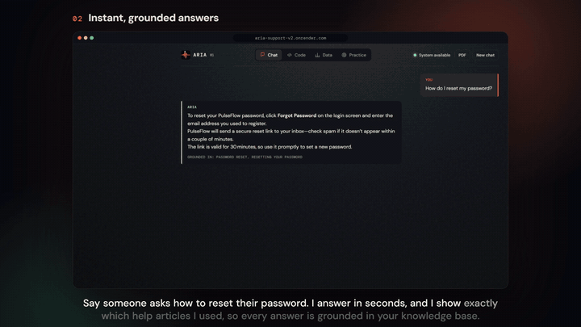
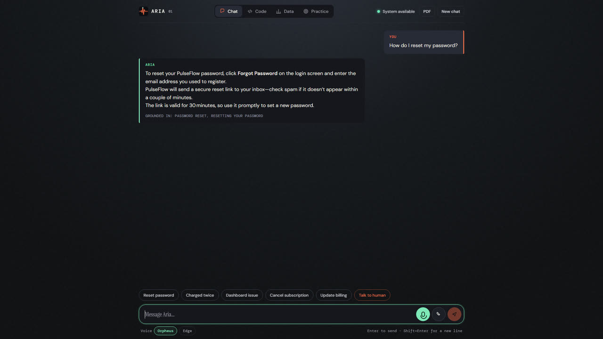
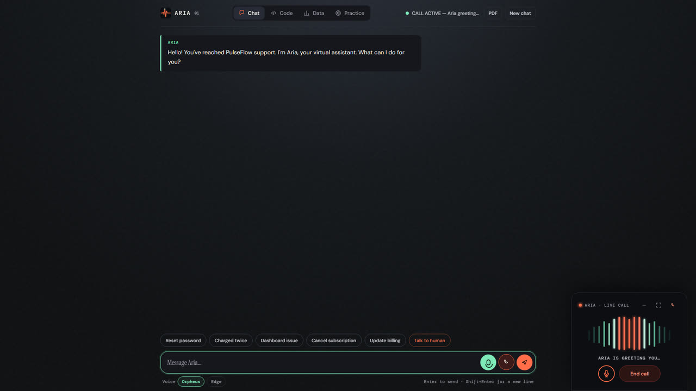
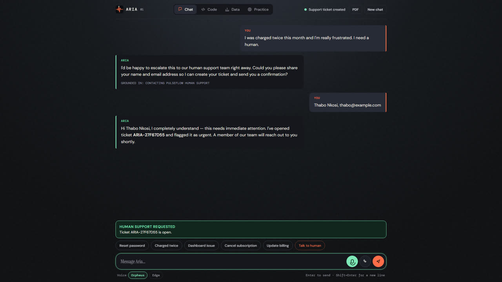
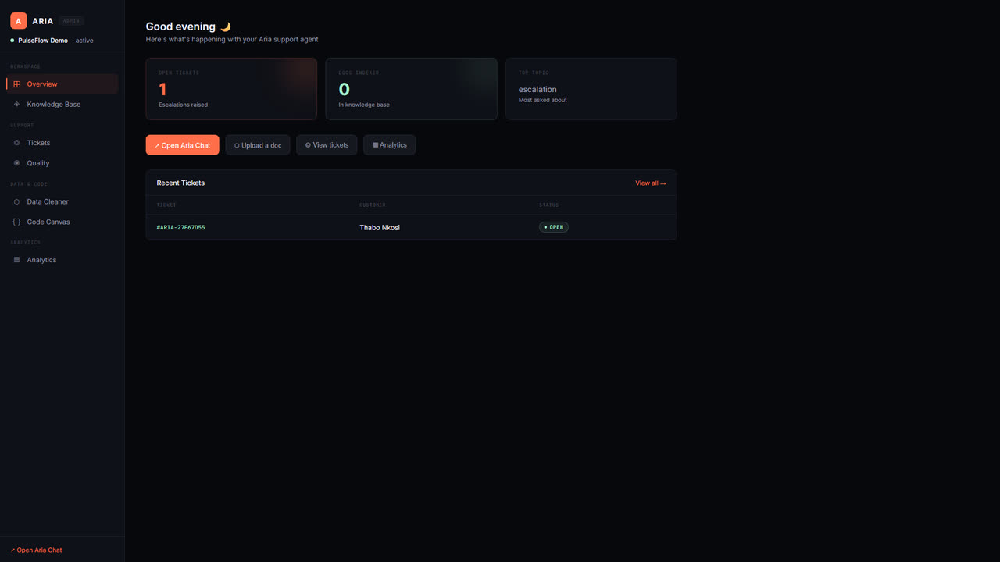
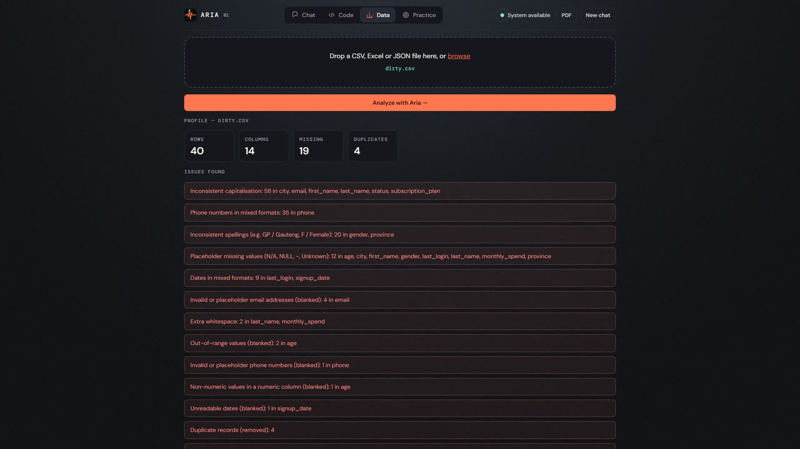
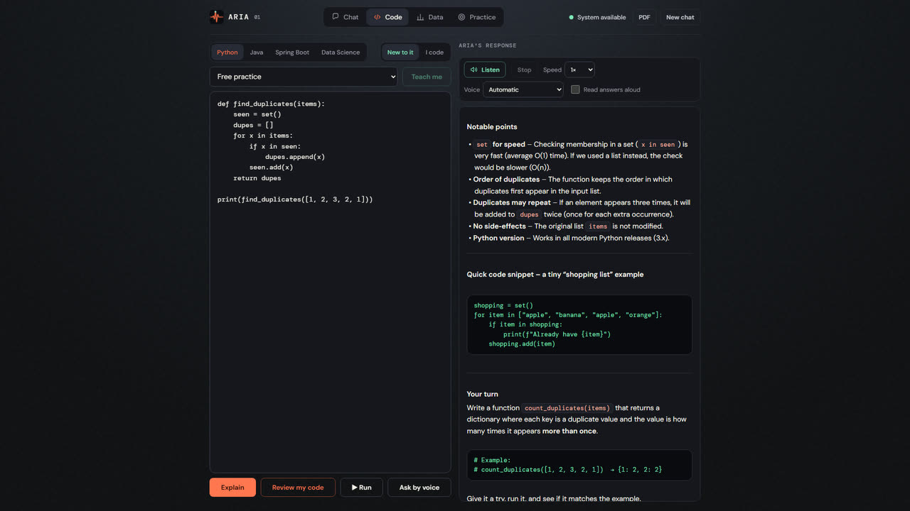
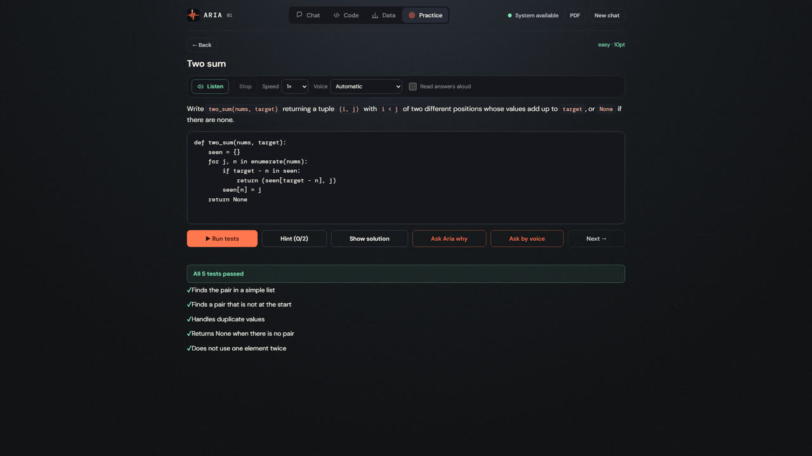
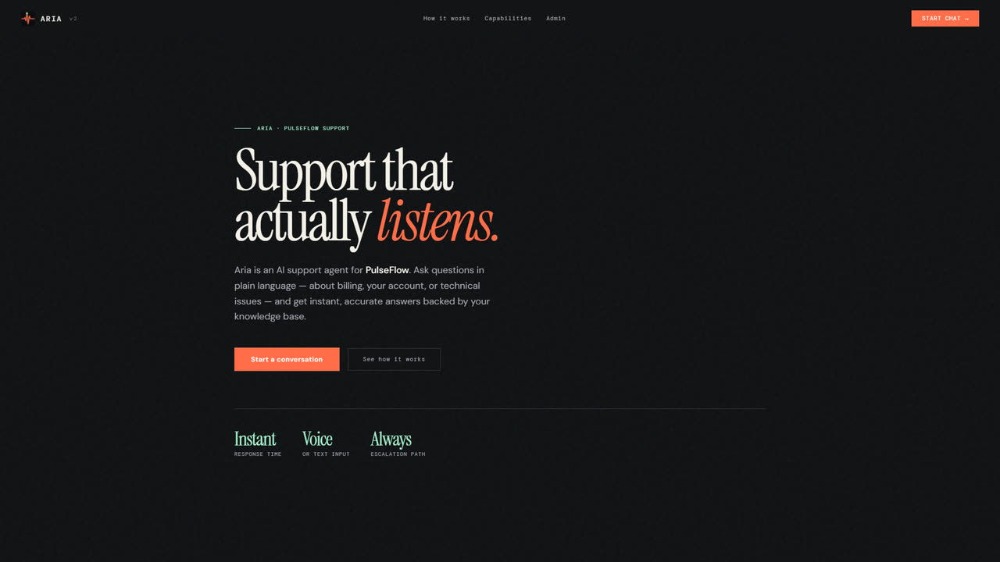

<div align="center">


# Aria

**Support that actually listens.**

An AI support agent that answers from your knowledge base, takes live voice calls, hands off to a human when it should,
cleans messy spreadsheets and teaches code, all in one app.

[**Live demo**](https://aria-support-v2.onrender.com) &nbsp;·&nbsp; [**Watch the 90-second tour**](api/static/media/aria-product-tour.mp4) &nbsp;·&nbsp; [Quick start](#quick-start)

<a href="api/static/media/aria-product-tour.mp4">
  
</a>

<sub>Click the preview to watch the full tour with sound. Aria narrates it herself, in her own voice.</sub>

</div>

---

## What Aria does

| | |
|---|---|
| **Grounded answers**<br/>Aria answers in seconds and shows exactly which knowledge-base articles she used.<br/><br/> | **Live voice calls**<br/>Tap the phone for a hands-free call. Aria greets you, listens and replies out loud, with mute and end-call always in reach.<br/><br/> |
| **Escalates to a human**<br/>When someone is frustrated Aria takes their details, opens an urgent ticket and hands over.<br/><br/> | **Admin dashboard**<br/>Your team sees new tickets instantly, alongside the knowledge base, data cleaner, code canvas and analytics.<br/><br/> |
| **Data cleaner**<br/>Drop in a CSV, Excel or JSON file. Aria profiles it, finds duplicates, mixed formats and missing values, and cleans it up.<br/><br/> | **Code tutor**<br/>Paste code and Aria explains it in plain English, then gives you something to try. Python, Java, Spring Boot and Data Science.<br/><br/> |
| **Practice and interviews**<br/>Challenges are graded against real tests, right in your browser, plus timed mock interviews.<br/><br/> | **Start anywhere**<br/>A quick first-time guide shows new users around. Replay it any time at `/chat?guide=1`.<br/><br/> |

### Highlights

- **Chat, voice or both.** Type, tap the mic, or start a live call. Voices: Orpheus (Groq), Microsoft Edge Aria, or the local Kokoro model.
- **Knowledge-base answers with sources.** Answers come from your own Markdown notes, and Aria says which ones.
- **Ticketing.** Escalations become tickets your team sees in the admin dashboard.
- **Data cleaner.** CSV, Excel and JSON profiling and cleanup, with a report of what changed.
- **Code tutor and practice.** Explain, review and run code; graded challenges and mock interviews.
- **Export.** Save a conversation as a PDF.
- **Works with a bad connection.** The app opens and Python practice keeps running offline once loaded.
- **Private by default.** Personal details are redacted before anything is logged.

---

## Architecture

```
Browser / API client
        │
        ▼
   FastAPI (main.py)
        │
   ┌────┴────┐
   │         │
/support  /voice + /transcribe
   │         │
LangGraph   Kokoro TTS (local .onnx)
workflow    Faster-Whisper STT (local)
   │
   ├── customer_lookup       — in-memory customer DB
   ├── account_status_checker
   ├── faq_search            — LangChain RAG on Obsidian KB
   ├── escalation_trigger    — keyword + billing rules
   ├── draft_response        — template (or Groq if key set)
   ├── propose_knowledge_note — writes review-queue note
   └── log_interaction       — PII-redacted Markdown audit log
```

**Key design decisions:**
- Groq is never called unless `GROQ_API_KEY` is set **and** a relevant FAQ was found — no wasted API calls
- PII (emails, phone numbers, names) is redacted via Presidio before anything hits the audit log
- Conversation history is kept in memory per `conversation_id` — up to 6 turns of context
- No vector database required to run; ChromaDB is installed and ready when you need scale

---

## Stack

| Layer | Technology |
|---|---|
| Agent orchestration | LangGraph |
| LLM (optional) | Groq — `llama-3.1-8b-instant` |
| Knowledge base RAG | LangChain + DirectoryLoader |
| PII redaction | Microsoft Presidio |
| NLP engine | spaCy `en_core_web_lg` |
| STT | Faster-Whisper `base.en` (local, CPU) |
| TTS | Kokoro ONNX `af_heart` (local) |
| API | FastAPI + Uvicorn |
| Storage | Obsidian-compatible Markdown |
| Vector DB (ready) | ChromaDB |
| Graph DB (ready) | Neo4j |

---

## Quick start

```powershell
# 1. Clone
git clone https://github.com/nqobile-x/AriaCall.git
cd AriaCall

# 2. Create virtual environment
uv venv venv

# 3. Install dependencies
uv pip install --python venv\Scripts\python.exe -r requirements.txt

# 4. Download spaCy model
$env:VIRTUAL_ENV="$PWD\venv"; venv\Scripts\python.exe -m spacy download en_core_web_lg

# 5. Copy and fill in your keys
copy .env.example .env

# 6. Run
venv\Scripts\uvicorn main:app --reload
```

Open `http://127.0.0.1:8000` for the Aria chat interface.
Open `http://127.0.0.1:8000/docs` for the interactive API docs.

---

## Configuration

Create a `.env` file at the project root (copy `.env.example`):

```env
# Required for Groq LLM responses (optional — works without it)
GROQ_API_KEY=

# Neo4j graph database (optional — for caller relationship graph)
NEO4J_URI=
NEO4J_USERNAME=
NEO4J_PASSWORD=

# Supabase (optional — for persistent storage)
SUPABASE_URL=
SUPABASE_KEY=

# Path to your Obsidian vault subfolder for Aria logs
# Aria writes into: <OBSIDIAN_VAULT>/Aria Support/Interactions/
# and reads KB from: <OBSIDIAN_VAULT>/Aria Support/Knowledge Base/
OBSIDIAN_VAULT=obsidian-vault
```

**Without any keys set**, Aria runs fully locally — no external API calls.

---

## Knowledge base

Put product, policy, and FAQ notes in `Aria Support/Knowledge Base/` inside your vault. LangChain loads and chunks them on startup; Aria retrieves the best matching chunk for each message.

```
obsidian-vault/
└── Aria Support/
    ├── Knowledge Base/
    │   ├── password-reset.md
    │   ├── billing-details.md
    │   └── returns-policy.md   ← add yours here
    └── Interactions/           ← auto-generated, PII-redacted logs
```

When no note answers a message, Aria writes a proposed note to `Knowledge Base/Review Queue/`. Review it, write the approved answer, and move it into the `Knowledge Base/` folder. Aria never promotes notes itself.

---

## API endpoints

| Method | Path | Description |
|---|---|---|
| `GET` | `/` | Aria chat UI |
| `GET` | `/health` | Health check — reports LLM mode |
| `POST` | `/support` | Submit a support message |
| `POST` | `/voice` | Text → WAV (Kokoro TTS) |
| `POST` | `/transcribe` | Audio file → text (Faster-Whisper) |
| `GET` | `/docs` | OpenAPI docs |

**POST /support**
```json
{
  "message": "How do I reset my password?",
  "customer_id": "demo-001",
  "conversation_id": "optional-uuid-for-multi-turn"
}
```

**Response**
```json
{
  "conversation_id": "...",
  "response": "Hi Amina, select Forgot password...",
  "customer": { "id": "demo-001", "name": "Amina Patel", ... },
  "account_status": { "status": "active", "plan": "Pro", ... },
  "faq_sources": [{ "title": "Resetting your password", "text": "..." }],
  "ticket": null,
  "escalated": false,
  "audit_logged": true,
  "learning_suggestion": null
}
```

---

## Voice pipeline

Voice works fully locally — no cloud STT or TTS.

- **STT**: Faster-Whisper `base.en` — auto-downloaded to `voice/.whisper-cache/` on first use
- **TTS**: Kokoro ONNX — model files go in `voice/models/`:
  - `kokoro-v1.0.onnx`
  - `voices-v1.0.bin`

The browser UI auto-detects silence and stops recording. Transcription and speech synthesis happen on the server.

---

## Demo customers

Two demo customers are pre-loaded for testing:

| ID | Name | Email | Plan |
|---|---|---|---|
| `demo-001` | Amina Patel | amina@example.com | Pro |
| `demo-002` | Sam Mokoena | sam@example.com | Starter |

Pass `customer_id` in the request, or include their email in the message — Aria will look them up automatically.

---

## Running tests

```powershell
$env:VIRTUAL_ENV="$PWD\venv"; venv\Scripts\python.exe -m unittest discover -s tests -p "test_*.py"
```

The suite (250+ tests) covers grounded KB retrieval, customer lookup, escalation and tickets, the code tutor and practice challenges, the data cleaner, offline mode, load protection and the UI contract.

---

## Deploying to Render

See `render.yaml` for the service definition. Key notes:

- Set `GROQ_API_KEY` as a Render environment secret
- Voice model files are large — use a **persistent disk** mounted at `./voice/models` on paid plans, or the `/voice` endpoint returns 503 on free plans until the models are present
- spaCy model downloads automatically on the first build via the build command in `render.yaml`
- Whisper downloads to `voice/.whisper-cache/` on first request — mount this directory on a persistent disk to avoid re-downloading on each deploy

---

## Roadmap

- [ ] ChromaDB vector search — replace keyword scoring with semantic embeddings
- [ ] Neo4j caller graph — link customers, tickets, and conversation history
- [ ] Supabase persistence — durable storage for interactions and tickets
- [ ] Sentiment analysis — auto-escalate frustrated customers using spaCy
- [ ] WebSocket streaming — stream Aria's response token by token
- [ ] Deepgram real-time STT — replace batch Whisper with live streaming transcription
- [ ] Multi-language support — `en-ZA` + other locales via spaCy and Kokoro voices
